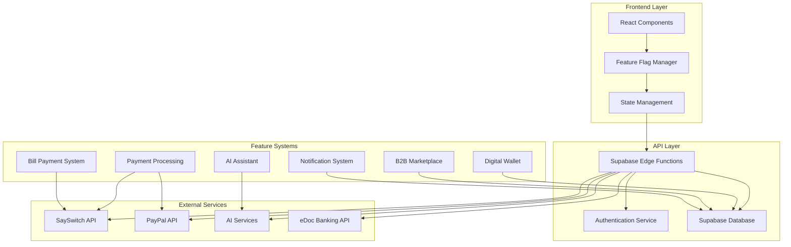
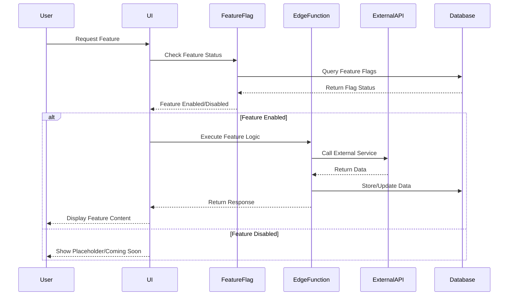

# Design Document

## Overview

This design document outlines the architecture and implementation approach for enabling all placeholder features in the SEFTEC application. The system will transition from showing "Coming Soon" placeholders to fully functional business features including payment integrations, AI services, dashboard components, and business management tools.

The design follows a phased approach to minimize risk and ensure stable rollouts, with comprehensive feature flag management, robust error handling, and seamless user experience transitions.

## Architecture

### High-Level Architecture



### Feature Flag Architecture

The system uses a hierarchical feature flag system with the following levels:
1. **System-level flags**: Global feature enablement
2. **User-level flags**: Per-user feature access
3. **Component-level flags**: Granular UI component control
4. **Service-level flags**: External service integration control

### Data Flow Architecture



## Components and Interfaces

### 1. Feature Flag Management System

#### FeatureFlagManager Component
```typescript
interface FeatureFlagManager {
  checkFeature(flagName: string, userId?: string): Promise<boolean>;
  updateFeature(flagName: string, enabled: boolean, scope: 'global' | 'user'): Promise<void>;
  getFeatureConfig(flagName: string): Promise<FeatureConfig>;
  subscribeToChanges(callback: (changes: FeatureChange[]) => void): void;
}

interface FeatureConfig {
  name: string;
  enabled: boolean;
  rolloutPercentage: number;
  userSegments: string[];
  dependencies: string[];
  metadata: Record<string, any>;
}
```

#### Enhanced Feature Flag Hook
```typescript
interface UseFeatureFlagResult {
  isEnabled: boolean;
  isLoading: boolean;
  config: FeatureConfig | null;
  error: Error | null;
  refresh: () => Promise<void>;
}
```

### 2. Payment Integration System

#### Unified Payment Interface
```typescript
interface PaymentProvider {
  name: string;
  initialize(config: PaymentConfig): Promise<void>;
  processPayment(request: PaymentRequest): Promise<PaymentResult>;
  getBillCategories(): Promise<BillCategory[]>;
  payBill(billRequest: BillPaymentRequest): Promise<BillPaymentResult>;
  transferMoney(transferRequest: TransferRequest): Promise<TransferResult>;
  getTransactionHistory(filters: TransactionFilters): Promise<Transaction[]>;
}

interface PaymentRequest {
  amount: number;
  currency: string;
  description: string;
  metadata: Record<string, any>;
  returnUrl?: string;
  cancelUrl?: string;
}

interface BillPaymentRequest {
  billType: 'airtime' | 'data' | 'electricity' | 'tv';
  provider: string;
  accountNumber: string;
  amount: number;
  customerInfo: CustomerInfo;
}
```

#### SaySwitch Integration
```typescript
interface SaySwitchProvider extends PaymentProvider {
  getNetworkProviders(): Promise<NetworkProvider[]>;
  validateMeterNumber(meterNumber: string, disco: string): Promise<MeterValidation>;
  getDataPlans(network: string): Promise<DataPlan[]>;
  getTVPackages(provider: string): Promise<TVPackage[]>;
}
```

#### PayPal Integration
```typescript
interface PayPalProvider extends PaymentProvider {
  createOrder(orderRequest: PayPalOrderRequest): Promise<PayPalOrder>;
  captureOrder(orderId: string): Promise<PayPalCapture>;
  refundPayment(captureId: string, amount?: number): Promise<PayPalRefund>;
}
```

### 3. AI Assistant System

#### BizGenie AI Interface
```typescript
interface AIAssistant {
  generateResponse(prompt: string, context: AIContext): Promise<AIResponse>;
  generateBusinessPlan(planRequest: BusinessPlanRequest): Promise<BusinessPlan>;
  analyzeMarketTrends(industry: string, region: string): Promise<MarketAnalysis>;
  getRecommendations(userId: string, category: string): Promise<Recommendation[]>;
  classifyQuery(query: string): Promise<QueryClassification>;
}

interface AIContext {
  userId: string;
  userPreferences: UserPreferences;
  conversationHistory: Message[];
  businessProfile: BusinessProfile;
}

interface BusinessPlanRequest {
  businessIdea: string;
  targetMarket: string;
  revenueModel: string;
  competition: string;
  advantages: string;
  fundingRequirements: string;
}
```

### 4. Dashboard Component System

#### Unified Dashboard Interface
```typescript
interface DashboardComponent {
  id: string;
  title: string;
  type: 'widget' | 'chart' | 'table' | 'form';
  isEnabled: boolean;
  data: any;
  config: ComponentConfig;
  refresh(): Promise<void>;
  export?(format: 'pdf' | 'csv' | 'excel'): Promise<Blob>;
}

interface MarketplaceComponent extends DashboardComponent {
  getProducts(filters: ProductFilters): Promise<Product[]>;
  createListing(product: ProductListing): Promise<string>;
  manageListing(listingId: string, action: ListingAction): Promise<void>;
}

interface WalletComponent extends DashboardComponent {
  getBalance(): Promise<WalletBalance>;
  getTransactions(filters: TransactionFilters): Promise<Transaction[]>;
  transferFunds(request: TransferRequest): Promise<TransferResult>;
  generateStatement(period: DateRange): Promise<Statement>;
}

interface TradeFinanceComponent extends DashboardComponent {
  getLoanOptions(): Promise<LoanOption[]>;
  applyForLoan(application: LoanApplication): Promise<string>;
  getTradeCredits(): Promise<TradeCredit[]>;
  requestTradeCredit(request: TradeCreditRequest): Promise<string>;
}
```

### 5. Notification System

#### Real-time Notification Interface
```typescript
interface NotificationService {
  sendNotification(notification: NotificationRequest): Promise<void>;
  subscribeToNotifications(userId: string, callback: NotificationCallback): void;
  getNotificationHistory(userId: string, filters: NotificationFilters): Promise<Notification[]>;
  updateNotificationSettings(userId: string, settings: NotificationSettings): Promise<void>;
  markAsRead(notificationIds: string[]): Promise<void>;
}

interface NotificationRequest {
  userId: string;
  title: string;
  message: string;
  type: 'info' | 'success' | 'warning' | 'error';
  channels: ('in-app' | 'email' | 'sms')[];
  metadata: Record<string, any>;
  expiresAt?: Date;
}
```

## Data Models

### Feature Flag Data Model
```typescript
interface FeatureFlag {
  name: string;
  enabled: boolean;
  description: string;
  rolloutPercentage: number;
  createdAt: Date;
  updatedAt: Date;
  dependencies: string[];
  userSegments: string[];
  metadata: Record<string, any>;
}
```

### Payment Transaction Data Model
```typescript
interface PaymentTransaction {
  id: string;
  userId: string;
  provider: 'sayswitch' | 'paypal';
  type: 'payment' | 'bill' | 'transfer';
  amount: number;
  currency: string;
  status: 'pending' | 'processing' | 'completed' | 'failed' | 'canceled';
  description: string;
  metadata: Record<string, any>;
  externalTransactionId: string;
  createdAt: Date;
  updatedAt: Date;
  completedAt?: Date;
}
```

### AI Interaction Data Model
```typescript
interface AIInteraction {
  id: string;
  userId: string;
  prompt: string;
  response: string;
  modelUsed: string;
  tokensUsed: number;
  responseTimeMs: number;
  queryComplexity: 'simple' | 'medium' | 'complex';
  estimatedCost: number;
  userFeedback?: number;
  feedbackText?: string;
  createdAt: Date;
}
```

### Business Profile Data Model
```typescript
interface BusinessProfile {
  id: string;
  userId: string;
  businessName: string;
  businessType: string;
  registrationNumber?: string;
  taxId?: string;
  address: Address;
  contactInfo: ContactInfo;
  edocMarkupPercentage: number;
  createdAt: Date;
  updatedAt: Date;
}
```

## Error Handling

### Error Classification System
```typescript
enum ErrorType {
  FEATURE_DISABLED = 'FEATURE_DISABLED',
  SERVICE_UNAVAILABLE = 'SERVICE_UNAVAILABLE',
  AUTHENTICATION_ERROR = 'AUTHENTICATION_ERROR',
  VALIDATION_ERROR = 'VALIDATION_ERROR',
  RATE_LIMIT_EXCEEDED = 'RATE_LIMIT_EXCEEDED',
  EXTERNAL_API_ERROR = 'EXTERNAL_API_ERROR',
  INSUFFICIENT_FUNDS = 'INSUFFICIENT_FUNDS',
  NETWORK_ERROR = 'NETWORK_ERROR'
}

interface ErrorResponse {
  type: ErrorType;
  message: string;
  code: string;
  details?: Record<string, any>;
  retryable: boolean;
  retryAfter?: number;
}
```

### Graceful Degradation Strategy
1. **Feature Unavailable**: Show informative message instead of "Coming Soon"
2. **Service Timeout**: Provide cached data or alternative options
3. **API Rate Limits**: Queue requests and show progress indicators
4. **Network Issues**: Enable offline mode where applicable
5. **Authentication Failures**: Redirect to re-authentication flow

### Error Recovery Mechanisms
```typescript
interface ErrorRecoveryStrategy {
  maxRetries: number;
  backoffStrategy: 'linear' | 'exponential';
  fallbackAction: 'cache' | 'alternative' | 'queue';
  userNotification: boolean;
  logLevel: 'error' | 'warn' | 'info';
}
```

## Testing Strategy

### Testing Pyramid Approach

#### Unit Tests (70%)
- Feature flag logic validation
- Payment provider integrations
- AI response processing
- Data model validations
- Error handling scenarios

#### Integration Tests (20%)
- API endpoint functionality
- Database operations
- External service integrations
- Feature flag propagation
- Real-time notification delivery

#### End-to-End Tests (10%)
- Complete user workflows
- Cross-feature interactions
- Payment processing flows
- AI conversation flows
- Dashboard functionality

### Test Data Management
```typescript
interface TestDataFactory {
  createUser(overrides?: Partial<User>): User;
  createPaymentTransaction(overrides?: Partial<PaymentTransaction>): PaymentTransaction;
  createFeatureFlag(overrides?: Partial<FeatureFlag>): FeatureFlag;
  createBusinessProfile(overrides?: Partial<BusinessProfile>): BusinessProfile;
}
```

### Feature Flag Testing
```typescript
interface FeatureFlagTestSuite {
  testFeatureEnabled(flagName: string): void;
  testFeatureDisabled(flagName: string): void;
  testRolloutPercentage(flagName: string, percentage: number): void;
  testUserSegmentation(flagName: string, userSegment: string): void;
  testFeatureDependencies(flagName: string, dependencies: string[]): void;
}
```

## Security Considerations

### Authentication and Authorization
- JWT-based authentication with refresh tokens
- Role-based access control (RBAC) for admin features
- API key management for external service integrations
- Rate limiting per user and per endpoint

### Data Protection
- Encryption at rest for sensitive data
- TLS 1.3 for data in transit
- PII data anonymization in logs
- GDPR compliance for user data handling

### Payment Security
- PCI DSS compliance for payment processing
- Webhook signature verification
- Secure API key storage using environment variables
- Transaction audit logging

### AI Security
- Input sanitization for AI prompts
- Response filtering for inappropriate content
- Usage tracking and anomaly detection
- Model access controls based on user tiers

## Performance Optimization

### Caching Strategy
```typescript
interface CacheStrategy {
  featureFlags: {
    ttl: 300; // 5 minutes
    strategy: 'memory' | 'redis';
  };
  aiResponses: {
    ttl: 3600; // 1 hour
    strategy: 'database';
  };
  paymentProviders: {
    ttl: 1800; // 30 minutes
    strategy: 'memory';
  };
  userPreferences: {
    ttl: 900; // 15 minutes
    strategy: 'memory';
  };
}
```

### Database Optimization
- Indexed queries for feature flags and user data
- Connection pooling for high-traffic endpoints
- Read replicas for analytics queries
- Partitioning for large transaction tables

### API Performance
- Response compression (gzip)
- Request/response caching
- Batch operations for bulk updates
- Asynchronous processing for heavy operations

## Monitoring and Observability

### Metrics Collection
```typescript
interface MetricsCollector {
  trackFeatureUsage(featureName: string, userId: string): void;
  trackPaymentTransaction(transaction: PaymentTransaction): void;
  trackAIInteraction(interaction: AIInteraction): void;
  trackError(error: ErrorResponse, context: Record<string, any>): void;
  trackPerformance(operation: string, duration: number): void;
}
```

### Health Checks
- Feature flag service availability
- External API connectivity
- Database connection status
- Cache service health
- AI service responsiveness

### Alerting System
- Feature flag deployment notifications
- Payment processing failures
- AI service degradation
- High error rates
- Performance threshold breaches

## Migration Strategy

### Phase 1: Infrastructure Setup
1. Enhanced feature flag system implementation
2. Database schema updates for new features
3. External service integration setup
4. Monitoring and logging infrastructure

### Phase 2: Core Feature Enablement
1. Payment provider integrations (SaySwitch, PayPal)
2. AI assistant functionality
3. Basic dashboard components
4. Notification system

### Phase 3: Advanced Features
1. Marketplace functionality
2. Wallet services
3. Trade finance features
4. Advanced AI capabilities

### Phase 4: Optimization and Polish
1. Performance optimizations
2. Advanced analytics
3. User experience enhancements
4. Additional integrations

### Rollback Strategy
- Feature flag-based instant rollback
- Database migration rollback scripts
- External service integration toggles
- User communication templates for service disruptions